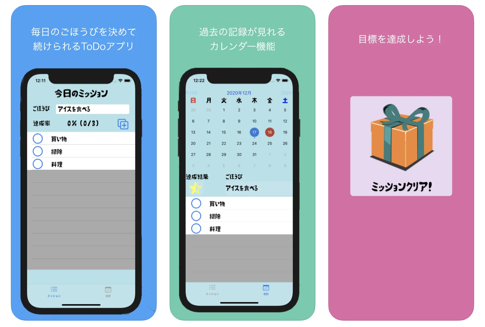

# ToDoMission
1日のごほうびを決めて取り組むToDoアプリ

https://apps.apple.com/jp/app/daily-mission/id1545055939

# Description
ToDoアプリです。

１日の目標とやることを決めて取り組むことが出来ます。

カレンダー機能があり、過去の記録を見ることが出来ます。

# Requirements
pod 'Google-Mobile-Ads-SDK'
pod 'FSCalendar'
pod 'CalculateCalendarLogic'
pod 'RealmSwift'

# Author
Masakazu Konno

